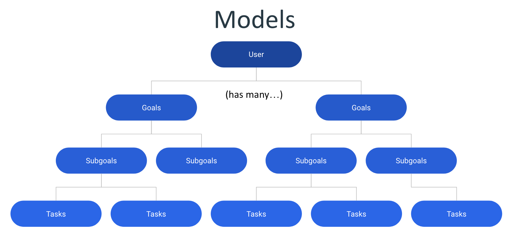
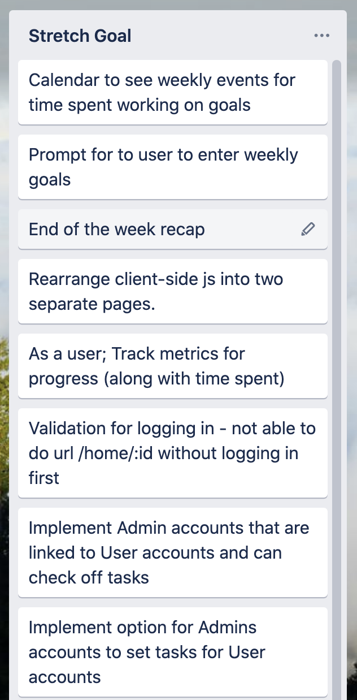
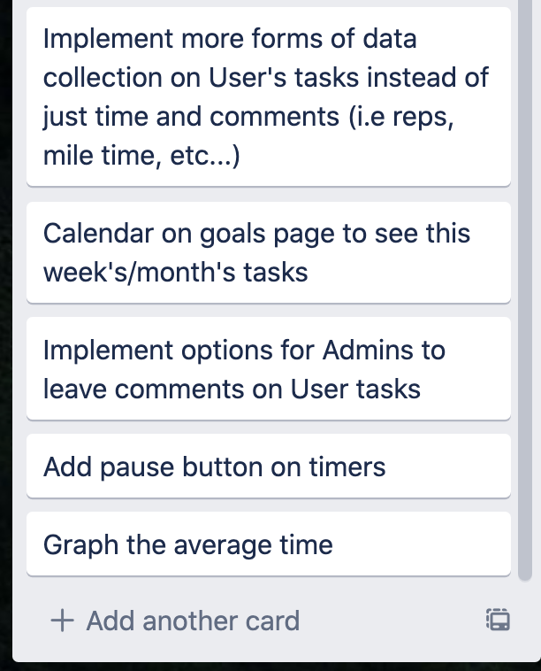

# WiP 
## <i>because life is always a work in progress...</i>

### [Deployed](https://vast-hollows-48558.herokuapp.com) Link || Git Hub [Repository](https://github.com/crackedsnowboard/project-maven)

 <b>WiP</b>  - Final Product Preview
 

    

## Table of Contents

* [Future Developments](#future_developments)

* [Take Aways](#take_aways)

* [Technologies Used](#technologies_used)

* [Contributors | Contact](#Contributors)

## Summary and Overview

For this project, our team decided to create an app that would help users plan and achieve their goals, whatever their goals may be (i.e. studying, exercise, music, etc... ). 

<b>WiP</b> is a goal oriented progress tracker app that helps divide and conquer large goals into smaller, more achievable, subgoals. It helps quantify progress by showing the user the amout of time they have invested into specific subgoals, and it encourages the user to continue working towards achieving their objectives.  

## Coronavirus Context

In the winter of 2020, Covid-19 spread throughout the planet and changed everything. Human to human interaction increased the risk for virus transmission and the world economy shut down. Our natural human contact points, such as schools, gyms and work environments ceased to operate. We were suddenly isolated and lost access to our natural human accountability partners.
Within this seismic change, we asked ourselves if technology could be used to help people to transition this time period until a vaccination can be found.  From this idea, we decided to build Wip (Work in Progress) to help users track their time toward learning objectives or personal goals.

 A user could easily create a button and hit a timer that could track their time spent against an goal. This would, ideally, help people keep on track of their educational, health, and work goals. Shared accounts between tutors and personal trainers could allow our historical accountability partners log on and see where we struggled or had spent time.
Please enjoy our app and we are welcome to feedback! - Joel Mathen

## Models

    

All data collected was stored in the same databse, however, there are separate tables for each of the following: User, Goals, Subgoals, and Tasks. From top down, all tables were associated with one to many relationships (see diagram above).

## Future_Developments

Stretch Goals            |  Stretch Goals Cont... 
:-------------------------:|:-------------------------:
  |  

Although our team was restricted on time, we did have many stretch goals planned for future development. The main features include the following:
 1) Creating shared accounts for instances like students and teachers 
 
 2) Adding a calendar UI to plan goals over specific time frames
 
 3) Providing more metrics of measurement for instances where total time is not as accurate (i.e. number of push-ups in a day) 

 

## Code Highlight

By using data-attributes, the handlebar #each function, and a conditional statement, I was able to dynamically generate buttons that not only change text but also change functionality after being clicked. 

When the button is associated with an order that has not been "devoured", the click function pushes that item to the second list. If the item is in the "devoured" list, that same button will now act as a delete button.
______________

Data Attribute:

    

Same class / different API call based on conditional:

    

## Take_Aways
MVC works really well to compartmentalize file structures. However, it requires a strong understanding of many moving parts that can take some time to fully understand.

## Technologies_Used

- Sequelize / mySQL / MVC structure
- Node.js / Javascript / ES6 
- NPM / Express / HandleBars
- Chartist
- Visual Studio Code
- Git / GitHub / Heroku
- Trello / Slack

## Contributors

<h2 align="center">
Joel Mathen
 </h2>

    

[GitHub](https://github.com/crackedsnowboard) | [LinkedIn](https://www.linkedin.com/in/joel-mathen/) | [Portfolio](https://crackedsnowboard.github.io/portfolio-highlights/)

<h2 align="center">
Samuel Levi Barrow
 </h2>

    

[GitHub](https://github.com/sbarrow825) | [LinkedIn](https://www.linkedin.com/in/sam-barrow/) | [Portfolio](https://sbarrow825.github.io/Unit-02-CSS-and-Bootstrap-Homework-Responsive-Portfolio/)

<h2 align="center">
Colin Whitcomb
 </h2>

    

[GitHub](https://github.com/Colin-Whitcomb) | [LinkedIn](https://www.linkedin.com/in/colin-whitcomb-b808301a6/) | [Portfolio](https://colin-whitcomb.github.io/Portfolio/)
