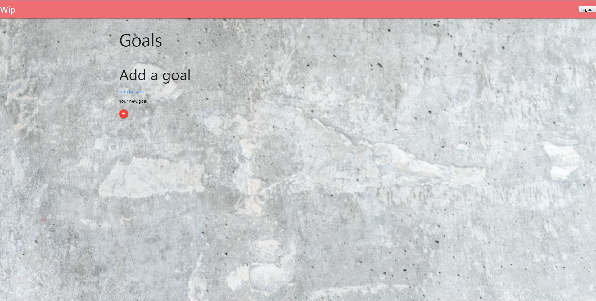
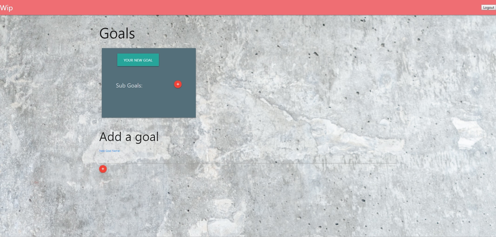
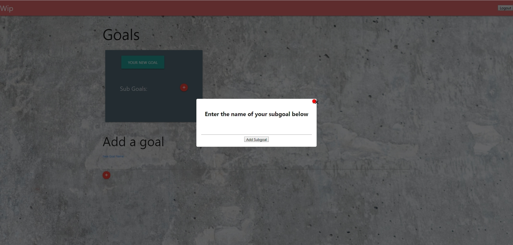
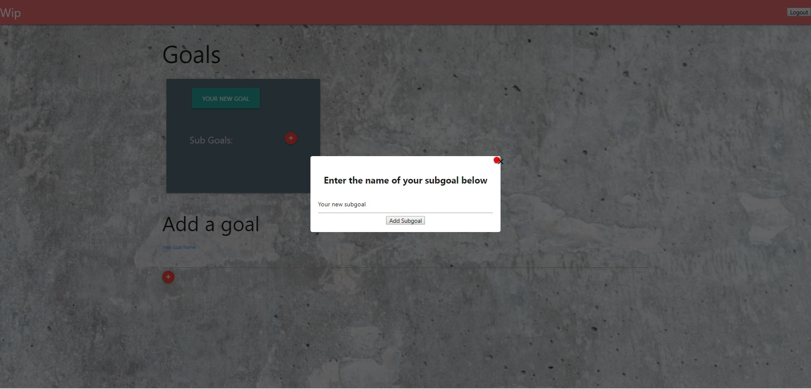
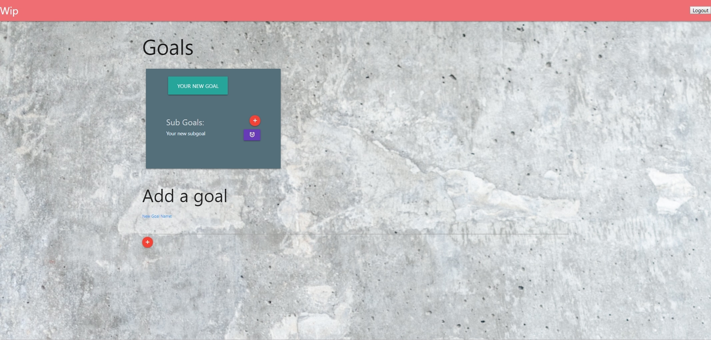
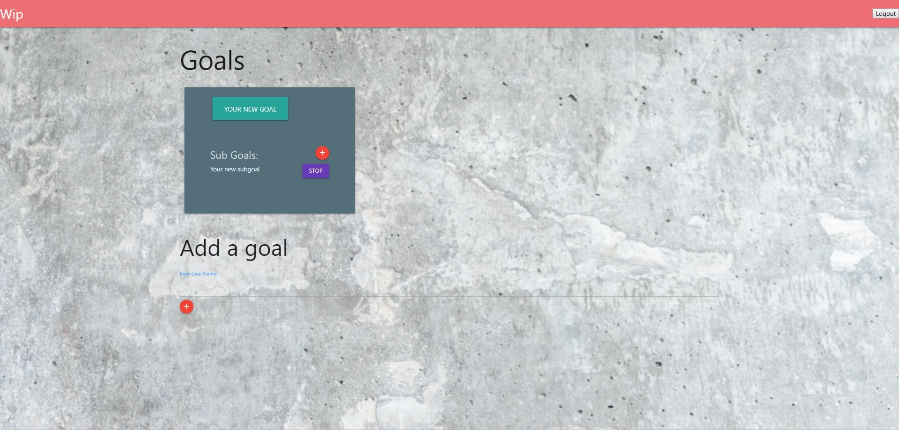
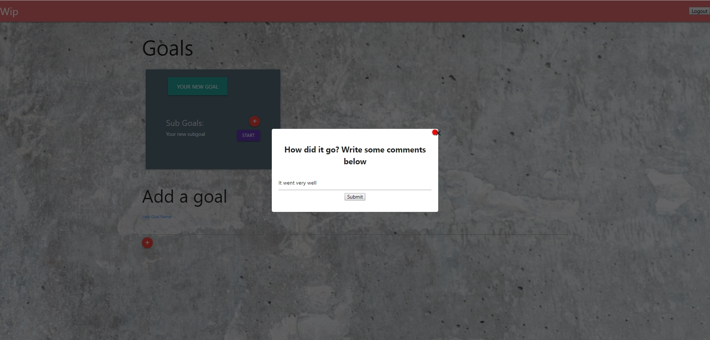
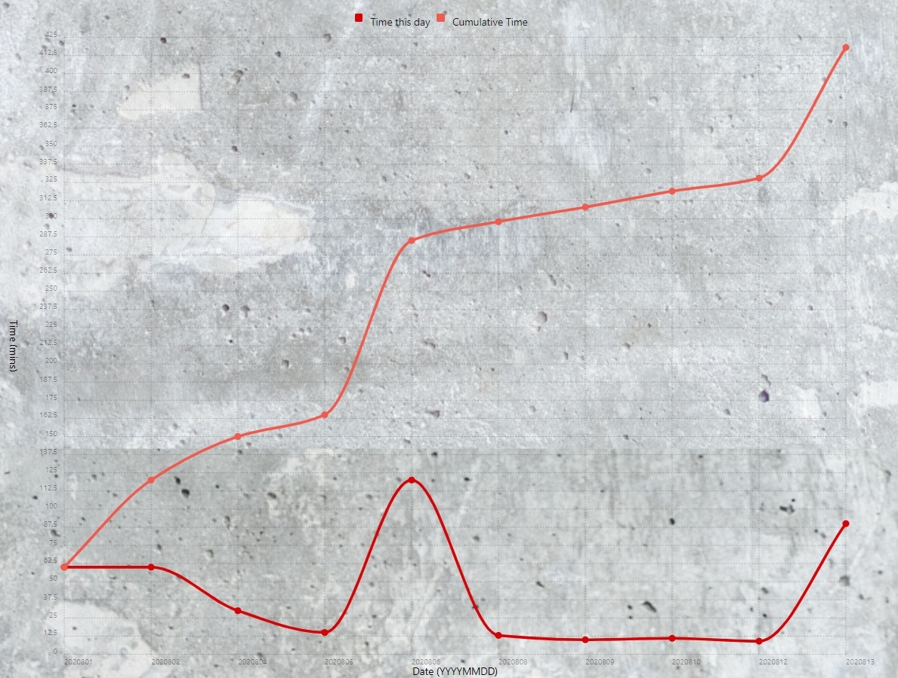

## Usage
To use the application, open the deployed app via the heroku link [here](https://vast-hollows-48558.herokuapp.com/login).

### Login and Signup
Upon opening the application, you should see a login page. If you already have an account, enter your email and password then hit the log in button. If you do not yet have an account, click the sign up link at the bottom of the login page.
To sign up, simply enter your email and password in the respective fields and hit the sign up button. Upon successful signup or login, you will automatically be redirected to the home page.

### Add a New Goal
To add a new goal, fill out the "Add a goal" form with the name of your goal and press "enter".

    

After adding a goal, you will see a new card populate the page with the name of your goal at the top.

    

### Add a Subgoal
To add a subgoal for one of your goals, click the red plus button to the right of "Sub Goals" on a given goal card.
A popup form will come up asking you to enter of the name of your subgoal. Enter the name then click the "Add Subgoal" button at the bottom of the form.
Afterwards, you should see a new subgoal displayed in the body of that goal card.

    

    

    

### Completing Tasks
To start a task for a given subgoal, click on the purple clock icon next to that subgoal.
You will see that clock icon transform into the word "Stop". This indicates that the timer for your task has started and is waiting for you to complete it and click "Stop" to finish the task.

    

Once you have completed your task, click the "Stop" button. You will be prompted by a popup form asking you to leave some comments on how your task went. Add your comments then hit the "Submit" button.

    

### Viewing your Personal Goal Data
To view your tasks and progression through time for a specific goal, click button with the name of your goal of interest to be brought to that goal's page.
On the goal page, you can see a card for each subgoal within that goal, as well as all the previously completed tasks for each subgoal displayed in the body of that card.
On this page, you have many other functionalities such as:

* Adding new subgoals
* Editing the name of your subgoals
* Deleting your subgoals
* Completing new tasks (with the timer button)
* Deleting saved tasks
* Editing comments on saved tasks

You will also notice a chart displayed at the bottom of the page. This chart displays both the amount of time you've worked on this goal each specific day as well as the cumulative time you've worked towards this goal since you first made it.
An example of this graph from a seeded test user is shown below.

    

